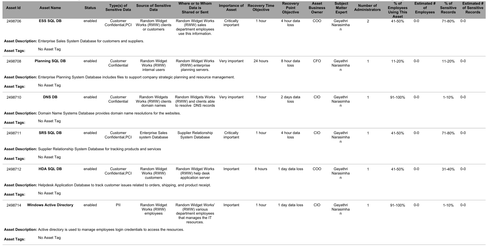
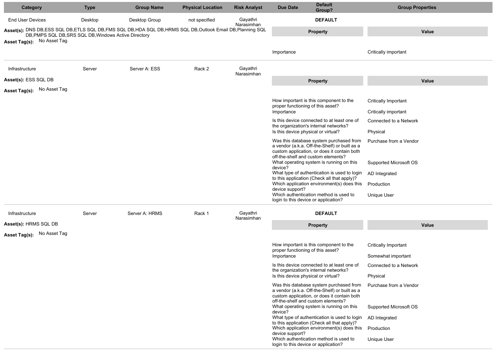
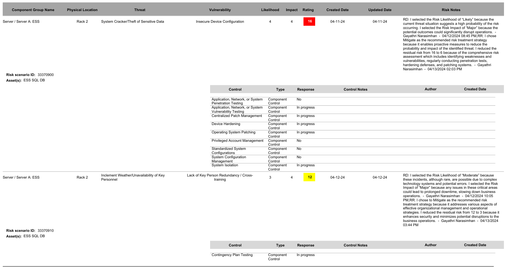
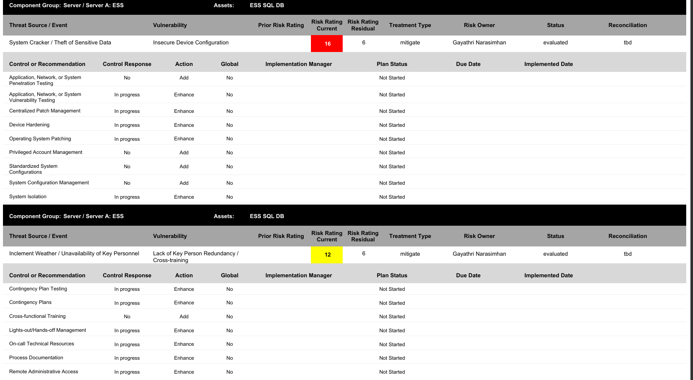

# Clearwater IRM Risk Assessment for RWW

## Overview
This project demonstrates a risk assessment and risk response process conducted for Random Widget Works (RWW), a fictional organization used in graduate cybersecurity coursework.

## Sample Preview

### Asset Inventory

### Component Groups

### Risk Rating

### Risk Response

## Project Objective
To identify critical assets, evaluate risks, and recommend controls to reduce risk using Clearwater IRM.

## What I Did
- Identified and documented key information assets
- Defined business ownership, sensitivity, and importance
- Recorded RTO and RPO values
- Organized assets into component groups
- Evaluated risk likelihood and impact
- Recommended mitigation controls and reduced residual risk

## Key Risk Areas
- Insecure device configuration
- User authentication weaknesses
- Data backup failures
- Account and password management issues
- Lack of operational redundancy

## NIST Alignment
This project aligns with NIST Cybersecurity Framework (CSF) and Risk Management Framework (RMF):

- Identify: Asset inventory and classification
- Protect: Controls such as MFA, patching, and access control
- Detect: Risk scenario identification
- Respond: Risk mitigation planning
- Recover: Backup and recovery (RTO/RPO)

## Skills Demonstrated

- Risk Assessment (Likelihood × Impact)
- Asset Inventory and Classification (PII, Critical Systems)
- Risk Rating and Prioritization
- Control Recommendation and Mitigation Planning
- Governance, Risk, and Compliance (GRC)
- NIST RMF Alignment

## Files
- RWW_Case_Overview.pdf
- Asset_Inventory_Report.pdf
- Component_Groups_Report.pdf
- Risk_Rating_Report.pdf
- Risk_Response_Report.pdf

## Business Impact

This project demonstrates how structured risk assessment improves organizational decision-making by identifying critical assets, prioritizing risks, and recommending controls to reduce potential business impact. The analysis supports better resource allocation and strengthens overall security posture.

## Tools Used
- Clearwater IRM

## Note
This project is based on academic coursework completed as part of a Master’s in Cybersecurity and was further developed into a personal portfolio project. RWW is a fictional organization used for educational purposes.
