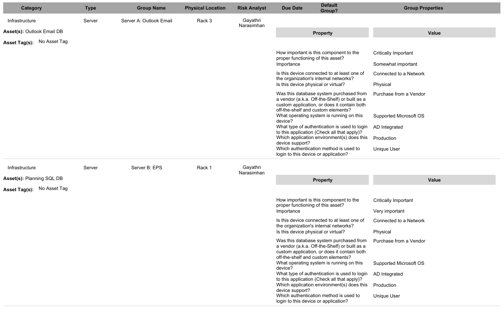
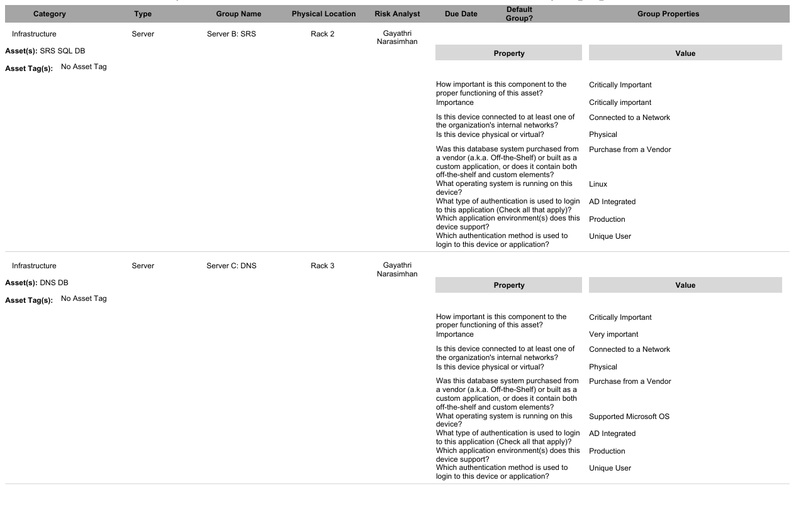

# Risk Component Analysis

## Overview
- This artifact summarizes component groups identified during a simulated enterprise risk assessment.
- The analysis helps show how systems, users, applications, and infrastructure are grouped to support risk visibility and control planning.

## Sample Output

## Key Takeaways

- Identified key infrastructure, application, user, and backup component groups
- Grouped systems based on business function and operational dependency
- Highlighted critical systems such as SQL databases and Active Directory
- Supported risk assessment by showing how assets connect to business operations
