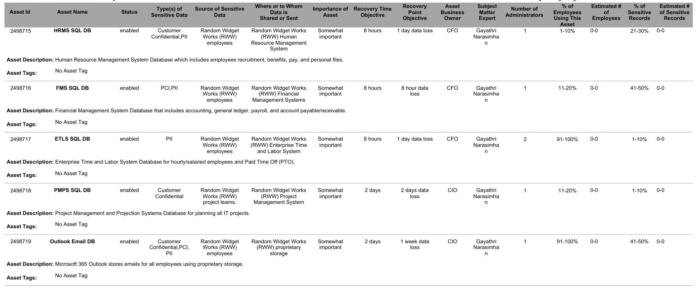

# Asset Inventory Report

## Overview
This report presents asset classification, data sensitivity, and recovery objectives identified during a simulated enterprise risk assessment.

## Sample Output

## Key Takeaways

- Identified systems containing PII, PCI, and confidential data
- Classified assets based on business importance
- Defined recovery objectives (RTO and RPO)
- Highlighted critical systems such as SQL databases and Active Directory
